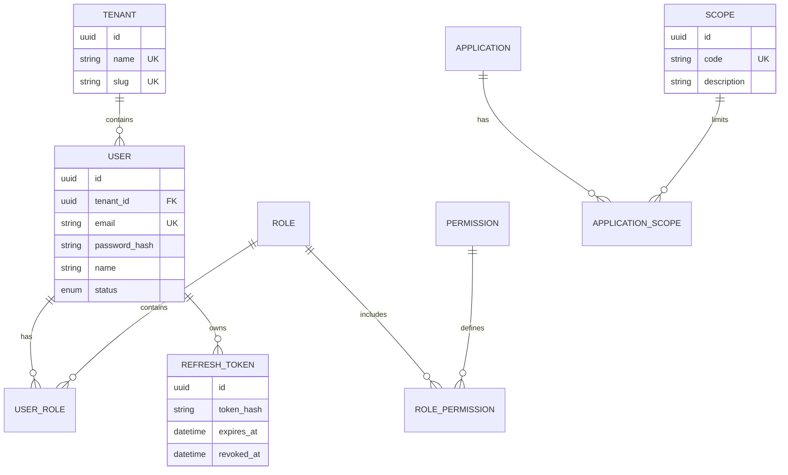

# Core Engine & Auth — Identity, Access & Integration Core (Squad 1)

**Versão:** 2.1  
**Código:** CORE-001  
**Squad:** Squad 1  
**Papel:** Produto central de identidade, autenticação, autorização, permissionamento e integração segura do ERP Modular Cloud-Native.

**Alterações na v2.1 (entrega integrada CTO, 29/05/2026):** inclusão de **multi-tenant lógico** (`tenant_id` em JWT e isolamento por tenant no Core), **API de identidade M2M** (`GET /v1/integration/users/:id`), papel **`suporte`**, **gateway multi-módulo** (contrato de roteamento) e dependências explícitas das Squads 2–5. Alinhado ao backlog Sprint 8 (`Sprints.md`, tasks 10–17).

**Escopo deste ficheiro:** PRD normativo do **MVP estendido**: login e-mail/senha, **OAuth 2.0 (Authorization Server)**, JWT, RBAC, **multi-tenant por organização (tenant)**, integração M2M com **client credentials**, escopos e validação no consumo, **gateway de entrada** para o ecossistema. **Login social**, **SSO/SAML** e **MFA/TOTP** permanecem **fora do escopo**; evoluções adicionais em **§25**.

---

## 1. Visão geral

O **Core Engine & Auth** é o sistema central de **IAM (Identity and Access Management)** do ecossistema. Opera em **duas frentes complementares**:

1. **Identity Core (uso interno ao ERP)** — Fornece autenticação (e-mail/senha no MVP), autorização (RBAC), gestão de usuários, papéis e permissões, e proteção de rotas para todos os módulos e squads internos, de forma transparente e padronizada.
2. **Integration Core (produto para aplicações/clientes)** — Permite que sistemas de terceiros e parceiros integrem de forma segura via **credenciais de aplicação** (`client_id` / `client_secret`), **escopos** e **tokens de integração**, sem expor o modelo de usuário humano da mesma forma que o fluxo interativo.

O **backend (API REST)** é a entrega principal; um **frontend administrativo** (opcional no MVP) é secundário e pode consumir os mesmos endpoints com perfis administrativos.

---

## 2. Problema

Squads e integradores precisam de **um único lugar** para:

- autenticar usuários humanos com políticas de senha e tokens coerentes;
- aplicar **RBAC** com papéis e permissões auditáveis;
- emitir e renovar **JWT** de forma segura (access + refresh com rotação);
- autenticar **aplicações** (machine-to-machine) com escopos explícitos;
- evitar que cada módulo reinvente login, permissões e integração — com risco de inconsistência e falhas de segurança.

Sem esse núcleo, o ecossistema fragmenta regras de acesso, dificulta auditoria e aumenta o custo de manutenção.

### 2.1. Objetivo do produto

Entregar um núcleo reutilizável de autenticação, autorização e integração segura que sustente o ecossistema do ERP Modular Cloud-Native, **reduzindo retrabalho entre squads** e elevando segurança, rastreabilidade e interoperabilidade — com **OAuth 2.0** como contrato padrão de tokens, **sem** MFA/TOTP e **sem** pretender ser um IAM completo estilo Keycloak.

### 2.2. Objetivo de negócio

**Valor interno:** acelerar o desenvolvimento dos demais módulos; reduzir inconsistência de login e permissões; simplificar governança de acesso; baixar custo de manutenção e suporte.

**Valor comercial:** o Core pode ser posicionado como base de identidade e integração para sistemas internos, ERPs modulares, cenários **multi-tenant por organização** (um `tenant_id` por contexto de negócio) e integrações B2B com aplicações parceiras (credenciais + escopos), desde que o posicionamento de limites do MVP fique explícito para o cliente.

---

## 3. Proposta de valor

| Dimensão | Benefício |
|----------|-----------|
| **Segurança** | Política de senha e hash moderno (Argon2id preferencial), rotação de refresh token, TTL e rate limit conforme RNFs, headers seguros (Helmet). |
| **Padronização** | Um único jeito de autenticar e autorizar no ecossistema; menos decisões ad hoc por squad. |
| **Desacoplamento** | Squads focam em domínio; IAM, RBAC e integração ficam no Core. |
| **Interoperabilidade** | JWT, **OAuth 2.0** (token endpoint e grants acordados), REST, OpenAPI; consumo por qualquer stack. |
| **Auditabilidade** | Logs e auditoria mínimos de autenticação e mudanças críticas de acesso. |
| **Escalabilidade de produto** | Multi-tenant lógico no Core (`tenant_id` + isolamento de dados); integrações controladas com escopos M2M. |
| **Produto vendável** | Identidade e integração com **OAuth 2.0** no núcleo; **OpenID Connect** (camada de identidade sobre OAuth) permanece **fora** até decisão explícita — ver §25. |

---

## 4. Personas

| Persona | Necessidade principal | Critério de sucesso (MVP) |
|---------|------------------------|---------------------------|
| **Administrador de sistema** | CRUD de usuários, papéis, permissões; ativar/desativar contas e aplicações; sem editar banco à mão. | Provisionar ou revogar acesso em poucos minutos, com trilha mínima (logs / auditoria básica). |
| **Gestor de TI / Segurança** | Política de senha aplicada, rate limit em rotas sensíveis, rastreabilidade de eventos críticos, OAuth 2.0 documentado. | Uma camada única e confiável; **sem** MFA/TOTP no escopo do produto. |
| **Desenvolvedor de módulo (ERP interno)** | Validar JWT, obter usuário atual, checar permissões sem reimplementar IAM. | Integrar auth/RBAC em **≤ 1 dia útil** com OpenAPI e exemplos disponíveis. |
| **Integrador / Dev externo** | Credenciais, escopos, token M2M e documentação estável. | Obter token e consumir recursos autorizados com erros previsíveis (`error.code`). |
| **Auditor / Segurança** | Logins falhos, alterações sensíveis e eventos críticos cobertos pelo MVP. | Conseguir correlacionar eventos com `requestId` / timestamp quando implementado. |

---

## 5. Escopo do produto (MVP)

### 5.1. Núcleo interno (usuários humanos)

- Cadastro de usuário (registro) e login e-mail + senha.
- Hash seguro de senha e validação.
- Emissão de **access token** (JWT) e **refresh token** com rotação.
- Endpoint `GET /v1/auth/me` (perfil + papéis/permissões efetivas conforme modelo).
- Gestão de usuários, papéis e permissões (CRUD administrativo conforme endpoints).
- Associação usuário ↔ papel e papel ↔ permissão.
- **RBAC** para autorização de operações.
- Proteção de rotas (Guards NestJS + validação JWT).
- Logs e auditoria **básica** (ver seção 23).
- Documentação **Swagger/OpenAPI 3** gerada e utilizável (“Try it out”).
- **Multi-tenant (MVP estendido):** entidade `Tenant`; usuários vinculados a `tenant_id`; claim `tenant_id` no JWT humano; propagação via header `X-Tenant-Id`; consultas filtradas por tenant (isolamento do Alicerce).
- Papel **`suporte`** no seed/RBAC: permissões operacionais **sem** acesso a domínio financeiro (coordenação com Squad 2 / Fiscal).

### 5.2. Camada de integração (aplicações)

- Cadastro de aplicações/clientes e emissão de credenciais (`client_id` + `client_secret`).
- Escopos por aplicação (catálogo + vínculo aplicação–escopo).
- Emissão de tokens M2M via **OAuth 2.0** `grant_type=client_credentials` no **token endpoint** (§14.7, **RF21–RF22**), com JWT de tipo integração e claims alinhados a **RF18**.
- Documentação pública de integração (RFC 6749 + exemplos de `curl` — repositório e/ou Swagger).
- **`GET /v1/integration/users/:id`:** leitura de identidade (id, name, email, status) para squads consumidoras via JWT `integration_access` e escopo mínimo (ex.: `identity:read` ou `users:read` no catálogo de escopos M2M). Complementa `GET /v1/users/:id` (RBAC humano com `users:read`).

### 5.3. Infraestrutura de entrega

- Stack: **TypeScript**, **NestJS**, **PostgreSQL**, **Prisma**, **JWT**, **Passport** (estratégia JWT, conforme §12), **Swagger**, **Docker**, **Jest**, **class-validator**, **class-transformer**.
- API versionada em **`/v1`**, JSON, Bearer Token onde aplicável.
- **CI:** pipeline com lint, testes e build (alinhar ao DoD, §23).
- **Gateway multi-módulo:** ponto de entrada HTTP (nginx/Portal Conexus — Squad 5) roteando `/v1/auth`, `/v1/integration` e prefixos dos módulos (Fiscal, CRM, Service Desk) **sem** expor login nas squads consumidoras — apenas validação do JWT emitido pelo Core (**regra de ouro**).

### 5.4. Resumo: núcleo do MVP vs evolução técnica

Não há “fase 2” de produto (sem MFA, sem promessa de roadmap em duas fases). Abaixo: **o que o MVP entrega** vs **melhorias posteriores opcionais** (§25).

| Área | Núcleo do MVP | Evolução técnica (roadmap §25) |
|------|----------------|-------------------------------|
| Login humano | E-mail + senha → JWT (access + refresh); alinhado a **OAuth 2.0** onde aplicável (**RF21**, **RF24**) | — |
| **OAuth 2.0** | **Authorization Server** com token endpoint (**RF21**), grants **client_credentials**, **refresh_token**, **password** (first-party, se ativado) | OIDC (discovery, `openid` scope), **authorization code + PKCE** para SPAs públicas, JWKS |
| Tokens e abuso | RNF03 (TTL) e RNF07 (rate limit + lockout) | Rate limit distribuído (Redis) em cluster |
| Integração M2M | **RFC 6749** `client_credentials` + escopos + **RF18** + **RF26** (identidade por UUID) | Endurecimento adicional de governança de clientes |
| Multi-tenant | `Tenant`, `tenant_id` em JWT, header `X-Tenant-Id`, filtro Prisma (**RF25–RF27**) | Multi-tenant avançado (billing por tenant, admin cross-tenant, sharding) — §25 |
| Gateway | Contrato de roteamento documentado (**RF28**) | Service mesh / API Gateway dedicado em produção |
| HTTP | Helmet; CSP por ambiente (dev vs produção) | CSP mais estrita, hardening contínuo |

### 5.5. Priorização (backlog)

Ordem sugerida para **cortar escopo sem travar go-live**:

| Prioridade | Itens |
|------------|--------|
| **P0 (go-live)** | **OAuth 2.0:** token endpoint (**RF21**) com `client_credentials` e `refresh_token`; login/registro e-mail+senha e/ou `password` grant (**RF24**); access + refresh com rotação; `/auth/me`; CRUD users/roles/permissions; vínculos; RBAC; papel **`suporte`**; aplicações + `client_secret` + escopos; validação **RF18**; **RF25–RF28** (tenant, identidade M2M, gateway); **RNF07**; OpenAPI **incluindo OAuth**; logs; `GET /health`. |
| **P1 (ainda MVP, se couber no sprint)** | Exemplos públicos (README); matriz inicial de `permission.code` e escopos; Helmet/CSP fino por ambiente. |
| **P2 (roadmap curto — §25)** | Logout com revogação; webhooks/eventos; RS256; frontend admin; OIDC / authorization code + PKCE. |

### 5.6. Ordem sugerida de implementação (incrementos)

Ordem prática para o time — **não** constitui “fase 2” de produto.

1. **Base:** registro/login/refresh, usuários, roles, permissions, `/auth/me`, **token OAuth** mínimo (`client_credentials` + `refresh_token`).  
2. **Autorização:** RBAC e guards; matriz mínima de permissões com squads.  
3. **Integração:** aplicações, escopos, **RF18** nas rotas M2M.  
4. **Endurecimento:** RNF07, auditoria §21, secrets e Helmet/CSP.  
5. **Adoção:** comunicação e exemplos para módulos consumirem o Core.

### 5.7. Dependências entre squads

- **O Core (Squad 1) entrega:** **OAuth 2.0**; emissão e validação JWT (`user_access` / `integration_access`); claims `sub` (user_id), `tenant_id`, `roles`, `perms` ou `scopes`; RBAC; **`GET /v1/integration/users/:id`**; papel **`suporte`**; isolamento por tenant no schema `core_engine`; documentação de gateway e integração.  
- **Squad 2 (Fiscal):** consome identidade do emitente via API Core (M2M), não via banco do Core; protege rotas financeiras com `perms` do JWT.  
- **Squad 3 (CRM):** exibe nome do usuário logado consultando Core por UUID (`sub`) ou `/auth/me`.  
- **Squad 4 (Service Desk):** demonstra usuário **`suporte`** sem acesso financeiro (403 na Squad 2).  
- **Squad 5 (DevOps/Portal):** banco centralizado com usuários/schemas por módulo; compose/K8s; CI/CD; URL de gateway (`http://<service>.<namespace>.svc.cluster.local:<porta>`).  
- **Regra de ouro:** nenhuma squad consumidora implementa **login** próprio — apenas valida a assinatura JWT do Core.

### 5.8. Entregáveis do Alicerce (demo CTO)

| Entregável | Evidência |
|------------|-----------|
| Central de identidade | Login central (`POST /v1/auth/login`), refresh, admin |
| Claims do token | JWT com `sub` (= `user_id`), `tenant_id`, `roles` (+ `perms` ou `scopes`) |
| API de gateway | Roteamento documentado para Core + módulos (§14.8, `docs/GATEWAY.md`) |
| Isolamento | Schema `core_engine` + filtro `tenant_id`; squads com DB user dedicado no `infra_banco` |

---

## 6. Escopo fora do produto (MVP)

| Item | Status |
|------|--------|
| **Multi-tenant avançado** (admin cross-tenant, billing, sharding) | **Fora do escopo** — ver §25. O MVP estendido inclui **tenant lógico** por organização (**RF25–RF27**). |
| **Login social / Google / provedores externos** | **Fora do escopo**. |
| **Plataforma IAM completa estilo Keycloak** | **Fora do escopo** — produto enxuto. |
| **OpenID Connect completo** (discovery, `id_token`, claims `openid`, etc.) | **Fora do MVP** — evolução em §25; **OAuth 2.0** (RFC 6749) está **no MVP**. |
| **Frontend como prioridade** | **Secundário**; não bloqueia entrega do backend. |
| **SSO corporativo (SAML, etc.)** | Fora do escopo. |
| **MFA, TOTP, WebAuthn, códigos de recuperação** | **Fora do escopo do produto** — não há plano de “segunda fase” para esses itens. |
| **Federação de identidade** | Fora do escopo. |
| **Auditoria avançada** (dashboard dedicado, retenção longa) | Roadmap §25; MVP cobre logs + auditoria mínima (§21). |
| **Eventos / webhooks públicos** | Roadmap §25. |

**Nota:** O núcleo é **JWT + OAuth 2.0 + RBAC + multi-tenant lógico + integração por client credentials e escopos**, **sem** OIDC completo no MVP.

---

## 7. Requisitos funcionais (numerados)

| ID | Requisito |
|----|-----------|
| **RF01** | Cadastro de usuário com e-mail único, nome e senha conforme política (ver RNFs e regras de negócio). |
| **RF02** | Autenticação de usuário com e-mail e senha; usuário inativo não autentica. |
| **RF03** | Emissão de access token JWT após login bem-sucedido (credenciais válidas e usuário ativo). |
| **RF04** | Emissão e renovação de refresh token com **rotação**: uso único do refresh enviado; novo par access/refresh após troca válida. |
| **RF08** | Endpoint `GET /v1/auth/me` retornando dados do usuário autenticado e autorizações efetivas (papéis/permissões). |
| **RF09** | CRUD de usuários (listagem paginada, detalhe, criação, atualização, alteração de status). |
| **RF10** | CRUD de papéis (roles). |
| **RF11** | CRUD de permissões (permissions); código único semântico (ex.: `user:write:all`). |
| **RF12** | Vínculo usuário–papel (associação e remoção em escopo de role). |
| **RF13** | Vínculo papel–permissão. |
| **RF14** | Cadastro de aplicação com nome, identificadores e status. |
| **RF15** | Geração e **regeneração** de `client_secret`; segredo **exibível apenas** na criação ou regeneração (nunca em listagens/detalhes posteriores). |
| **RF16** | Definição de escopos permitidos por aplicação (associação e listagem). |
| **RF17** | Emissão de token M2M mediante **OAuth 2.0** `grant_type=client_credentials` no token endpoint (**RF21**), com `client_id` + `client_secret`; aplicação inativa não recebe token. O endpoint legado `POST /v1/integration/token` pode existir como **alias** do mesmo comportamento até remoção documentada. |
| **RF18** | Validação de **escopos no consumo**: em toda rota aceitando JWT de integração (`type: integration_access`), o backend verifica que o conjunto `scopes` do token **cobre** os escopos exigidos pela rota (ex.: metadata em controller + `ScopesGuard` / decorator `@RequireScopes('code1','code2')` após validação JWT). |
| **RF19** | Endpoint de saúde `GET /v1/health` para probes (liveness/readiness conforme impl.). |
| **RF20** | Documentação OpenAPI atualizada com todos os endpoints públicos do MVP, **incluindo o token endpoint OAuth 2.0** (parâmetros, respostas e erros alinhados à RFC 6749). |
| **RF21** | O serviço atua como **Authorization Server OAuth 2.0** (RFC 6749): expor **token endpoint** versionado (ex.: `POST /v1/oauth/token`), com `Content-Type: application/x-www-form-urlencoded` (ou JSON se o time padronizar, desde que documentado), retornando access token (JWT), opcional refresh token e metadados (`token_type`, `expires_in`) conforme o grant. |
| **RF22** | Suportar **`grant_type=client_credentials`** para clientes confidenciais, com validação de escopos solicitados ⊆ escopos cadastrados (**RF16**, **RF18**). |
| **RF23** | Suportar **`grant_type=refresh_token`** alinhado à **RF04** (rotação obrigatória do refresh). |
| **RF24** | Suportar **`grant_type=password`** apenas para **clientes first-party** internos (ex.: mesma organização), **ou** manter `POST /v1/auth/login` e `POST /v1/auth/refresh` como rotas de conveniência que produzem os **mesmos** tokens e semântica que os grants OAuth equivalentes — documentar uma das abordagens no OpenAPI para evitar dois comportamentos divergentes. |
| **RF25** | Modelar **Tenant** e associar cada **User** a um `tenant_id`; seed com tenant padrão para demonstração. |
| **RF26** | Incluir claim **`tenant_id`** no JWT `user_access` e retornar `tenantId` (ou objeto tenant) em `GET /v1/auth/me`. Documentar equivalência **`sub` = `user_id`**. |
| **RF27** | Propagar contexto de tenant via header **`X-Tenant-Id`** (coerente com o JWT) e filtrar listagens/detalhes de usuários (e demais entidades tenant-scoped) por `tenant_id`. |
| **RF28** | Documentar e configurar **gateway multi-módulo**: roteamento de prefixos HTTP para Core e squads consumidoras sem login duplicado. |
| **RF29** | Expor **`GET /v1/integration/users/:id`** para leitura de identidade por UUID com JWT M2M e escopo mínimo (**RF18**). Manter **`GET /v1/users/:id`** para fluxo humano com permissão `users:read`. |
| **RF30** | Papel **`suporte`** no catálogo de roles: permissões limitadas (sem domínio financeiro) e usuário de demonstração para integração com Squad 4. |

---

## 8. Requisitos não funcionais (mensuráveis)

| ID | Categoria | Requisito |
|----|-----------|-----------|
| **RNF01** | Performance | Latência p95 **menor que 300 ms** em endpoints de leitura simples (`/health`, `/auth/me`) em ambiente de referência (hardware definido no projeto), sem carga extrema. |
| **RNF02** | Performance | `POST /v1/auth/login` e `POST /v1/integration/token` p95 **menor que 500 ms** em condições normais de laboratório. |
| **RNF03** | Tokens | Access token: TTL padrão **15 minutos** (configurável via env); refresh token: TTL padrão **7 dias** (configurável). |
| **RNF04** | Tokens | Algoritmo JWT: **HS256** no MVP (secret forte em env); documentar migração futura para RS256 se necessário. |
| **RNF05** | Testes | Cobertura de testes unitários **≥ 80%** em módulos de domínio crítico (auth, autorização, integração). |
| **RNF06** | Testes | Testes e2e mínimos para fluxos: login, refresh, `/me`, token integração. |
| **RNF07** | Rate limit | **5 tentativas/minuto** por **IP** e, em paralelo, por **e-mail** em `POST /v1/auth/login` e rotas análogas sensíveis; bloqueio temporário **30 minutos** após **5 falhas consecutivas** em qualquer um dos eixos (contadores conforme implementação, valores configuráveis por env se necessário). |
| **RNF08** | Senha | Argon2id (preferencial) ou Bcrypt cost ≥ 12; comprimento mínimo **10** caracteres; complexidade: maiúscula, minúscula, número e especial; lista de senhas comuns rejeitada. |
| **RNF09** | Disponibilidade | Healthcheck utilizável por orquestrador; falha de dependência refletida de forma clara. |
| **RNF10** | Manutenibilidade | Código TypeScript estrito; validação de entrada com class-validator; sem segredos no repositório. |
| **RNF11** | Logs | Logs estruturados (JSON) com `requestId` correlacionável quando possível. |

*(Ajuste métricas de performance ao ambiente acadêmico/produção no plano de testes.)*

---

## 9. Regras de negócio

| ID | Regra |
|----|--------|
| **RN01** | Usuário com status **inativo** (ou equivalente) **não** autentica. |
| **RN02** | `client_secret` só é retornado **na criação** da aplicação ou após **`regenerate-secret`**; demais respostas mascaram ou omitem. |
| **RN03** | Refresh token: **rotação obrigatória** — após uso, token antigo invalidado; tentativa de reuso deve falhar com erro de segurança claro. |
| **RN04** | Aplicação **inativa** não obtém token de integração. |
| **RN05** | **Escopos** limitam o que a aplicação pode fazer em nome do fluxo M2M; **permissões RBAC** limitam o que **usuários humanos** fazem nos endpoints administrativos. |
| **RN06** | E-mail de usuário e códigos únicos (`permission.code`, `role.name`, `application.clientId` onde aplicável) devem gerar **409 Conflict** em duplicidade. |
| **RN07** | Permissões devem existir antes de vincular a papéis; usuários devem existir antes de vincular a papéis (validação referencial). |
| **RN08** | Papéis sugeridos para documentação: `admin`, `manager`, `operator`, `viewer` — podem ser criados via API conforme RF10. |

---

## 10. Casos de uso principais

1. **Registrar e logar** — Usuário cria conta e faz login; recebe tokens após credenciais válidas.
2. **Renovar sessão** — Cliente envia refresh válido e recebe novo par com rotação.
3. **Obter contexto** — Cliente chama `/auth/me` com Bearer access token.
4. **Administrar acesso** — Admin gerencia usuários, papéis, permissões e vínculos.
5. **Integrar sistema externo** — Cadastra aplicação, guarda secret, associa escopos, obtém token via `/integration/token` e chama APIs permitidas.

---

## 11. Fluxos principais

### 11.1. Autenticação humana (MVP)

```
Cliente → POST /v1/auth/login (email, password)
Servidor valida credenciais e status → emite access + refresh
Cliente → requisições com `Authorization: Bearer {access_token}`
```

### 11.3. Refresh token (rotação)

```
Cliente → POST /v1/auth/refresh (refresh_token)
Servidor valida, invalida refresh usado, emite novo access + novo refresh
```

### 11.4. RBAC (autorização)

```
Request → Guard JWT → extrai sub / roles / perms
Guard de permissão → verifica permissão necessária na rota
Negado → 403 + error.code adequado
```

### 11.5. Integração M2M

```
Cliente → POST /v1/integration/token (client_id, client_secret [, scope opcional])
Servidor valida aplicação ativa, escopos solicitados ⊆ escopos cadastrados
Emite JWT tipo integração com claims de escopos e identificação da aplicação
```

---

## 12. Especificação técnica

### 12.1. Módulos sugeridos (NestJS)

| Módulo | Responsabilidade |
|--------|------------------|
| **Auth** | Register, login, refresh, `/me` |
| **Users** | CRUD usuários, status |
| **Roles** | CRUD roles, vínculos usuários e permissões |
| **Permissions** | CRUD permissões |
| **Applications** | CRUD apps, escopos, regenerate secret |
| **Integration** | Emissão de token M2M |
| **Health** | Healthcheck |
| **Audit** (opcional no MVP) | Persistência ou agregação mínima de eventos críticos alinhados a §21; pode ser módulo fino ou serviço interno ao `Auth` até evoluir. |
| **Common** | Filtros de exceção, envelope resposta, interceptors, requestId |

### 12.2. Componentes

- **Controllers** — Rotas REST versionadas.
- **Guards** — `JwtAuthGuard`, `PermissionsGuard`, distinção de tipo de token (usuário vs integração), **`ScopesGuard` (ou equivalente)** em rotas M2M conforme RF18.
- **Strategies** — Passport JWT para validação de assinatura e claims.
- **Services** — Regras de negócio e orquestração.
- **Prisma** — Persistência; transações para rotação de refresh e vínculos críticos.

### 12.3. Relações entre componentes

```
HTTP → Middleware (Helmet, rate limit) → ValidationPipe → Guard → Controller → Service → Prisma → PostgreSQL
```

### 12.4. Estratégia de escopos (integração)

- Catálogo global de **Scope** (`code` único, ex.: `orders.read`).
- **ApplicationScope** vincula aplicação a um subconjunto de escopos.
- Token de integração carrega `scopes: string[]` concedidos (interseção do pedido com o cadastrado).
- **Consumo (RF18):** cada handler exposto ao M2M declara explicitamente os escopos mínimos; o guard compara com `scopes` do JWT (ex.: `SetMetadata('scopes', ['orders.read'])` + validação após `JwtAuthGuard`). Rotas apenas para usuários humanos usam **permissions** RBAC, não este guard de escopos.

### 12.5. Eventos assíncronos (evolução)

O PRD original citou eventos (`user.created`, etc.) via message broker — tratar como **roadmap pós-MVP** ou fase 2, salvo decisão explícita do time de incluir fila no MVP.

---

## 13. Arquitetura sugerida

- **API monolítica modular** NestJS (adequado ao MVP).
- **PostgreSQL** como fonte de verdade relacional.
- **Docker Compose** para app + banco em desenvolvimento; variáveis por ambiente.
- **Multi-tenant lógico:** schema PostgreSQL dedicado (`core_engine` no banco `infra_banco`); usuário DB `user_core_engine`; isolamento por `tenant_id` no domínio do Core; demais squads com schemas/usuários próprios no mesmo cluster (Squad 5).
- **Gateway:** entrada HTTP única (nginx local ou Portal Conexus) encaminhando para Core e módulos.

---

## 14. Catálogo de endpoints (`/v1`)

Métodos e corpos devem ser detalhados no Swagger; abaixo o contrato alvo.

### 14.1. Saúde

| Método | Rota | Descrição |
|--------|------|-----------|
| `GET` | `/v1/health` | Status do serviço e dependências críticas. |

### 14.2. Autenticação (fluxo humano)

| Método | Rota | Descrição |
|--------|------|-----------|
| `POST` | `/v1/auth/register` | Cadastro de usuário. |
| `POST` | `/v1/auth/login` | Login e-mail/senha; emite tokens após credenciais válidas. |
| `POST` | `/v1/auth/refresh` | Renovação com rotação de refresh token. |
| `GET` | `/v1/auth/me` | Perfil e autorizações do usuário autenticado. |

### 14.3. Usuários

| Método | Rota | Descrição |
|--------|------|-----------|
| `GET` | `/v1/users` | Lista paginada (filtros: email, status). |
| `GET` | `/v1/users/:id` | Detalhe. |
| `POST` | `/v1/users` | Criação (admin). |
| `PATCH` | `/v1/users/:id` | Atualização parcial. |
| `PATCH` | `/v1/users/:id/status` | Ativar/inativar. |

*Rotas de usuário exigem JWT `user_access` e permissão RBAC (`users:read` / `users:write`). Respeitam isolamento por `tenant_id` (**RF27**).*

### 14.3.1. Identidade para integração (M2M)

| Método | Rota | Descrição |
|--------|------|-----------|
| `GET` | `/v1/integration/users/:id` | Detalhe de usuário por UUID para squads consumidoras; JWT `integration_access` + escopo mínimo (**RF26**, **RF29**). |

### 14.4. Papéis e permissões

| Método | Rota | Descrição |
|--------|------|-----------|
| `GET` | `/v1/roles` | Lista papéis. |
| `POST` | `/v1/roles` | Cria papel. |
| `GET` | `/v1/permissions` | Lista permissões. |
| `POST` | `/v1/permissions` | Cria permissão. |
| `POST` | `/v1/roles/:id/users` | Associa usuário(s) ao papel (body com userId ou lista). |
| `POST` | `/v1/roles/:id/permissions` | Associa permissão(ões) ao papel. |

*Operações de remoção podem ser `DELETE` nos mesmos recursos ou sub-rotas — definir no OpenAPI de forma única (ex.: `DELETE /v1/roles/:roleId/users/:userId`).*

### 14.5. Aplicações e integração

| Método | Rota | Descrição |
|--------|------|-----------|
| `GET` | `/v1/applications` | Lista aplicações. |
| `GET` | `/v1/applications/:id` | Detalhe (sem secret). |
| `POST` | `/v1/applications` | Cria aplicação; retorna `client_secret` **uma vez**. |
| `PATCH` | `/v1/applications/:id` | Atualização. |
| `PATCH` | `/v1/applications/:id/status` | Ativar/desativar. |
| `POST` | `/v1/applications/:id/regenerate-secret` | Novo secret; exibido **uma vez**. |
| `POST` | `/v1/applications/:id/scopes` | Associa escopos à aplicação. |
| `GET` | `/v1/applications/:id/scopes` | Lista escopos da aplicação. |
| `POST` | `/v1/integration/token` | OAuth-style client credentials **simplificado** — retorna access token M2M. |
| `POST` | `/v1/oauth/token` | Token endpoint OAuth 2.0 (**RF21**). |

### 14.6. Documentação

| Método | Rota | Descrição |
|--------|------|-----------|
| `GET` | `/v1/docs` ou `/api` | Swagger UI (convenção Nest; expor de forma segura por ambiente). |

### 14.7. Gateway multi-módulo (contrato)

O Core **não substitui** o Portal Conexus (Squad 5), mas define o contrato que o gateway deve cumprir:

| Prefixo / destino | Serviço | Observação |
|-------------------|---------|------------|
| `/v1/auth`, `/v1/users`, `/v1/roles`, `/v1/oauth`, `/v1/integration`, `/v1/health` | Core Engine | Única origem de login humano e tokens |
| `/v1/fiscal/*` (exemplo) | Squad 2 | Valida JWT do Core; sem `/login` local |
| `/v1/crm/*` (exemplo) | Squad 3 | Idem |
| `/v1/service-desk/*` (exemplo) | Squad 4 | Idem |

Formato de URL interna (Kubernetes): `http://<nome-do-service>.<namespace>.svc.cluster.local:<porta>` — ex.: `http://core-engine-svc.default.svc.cluster.local:8080/v1/...`

Documentação operacional: `docs/GATEWAY.md` (a produzir na Sprint 8, task 14).

---

## 15. Modelo de dados

### 15.1. Diagrama ER (conceitual)



### 15.2. Entidades e enums (resumo)

| Entidade | Descrição |
|----------|-----------|
| **Tenant** | Organização lógica; `name` e `slug` únicos; agrupa usuários. |
| **User** | Dados de conta; `tenantId` obrigatório; `passwordHash`; `status` (enum: `ACTIVE`, `INACTIVE`, …). E-mail único **por tenant** (ou global — definir no OpenAPI; recomendado: único por tenant). |
| **Role** | Papel agregador de permissões; `name` único. |
| **Permission** | `code` único semântico; descrição. |
| **UserRole** | N:N usuário e papel. |
| **RolePermission** | N:N papel e permissão. |
| **RefreshToken** | Token opaco ou hash do token; `userId`; `expiresAt`; `revokedAt`; `replacedBy` opcional para auditoria de rotação. |
| **Application** | `clientId` público único; `clientSecretHash`; `name`; `status` (`ACTIVE` / `INACTIVE`). |
| **Scope** | Catálogo global de escopos integráveis. |
| **ApplicationScope** | N:N aplicação e escopo. |
| **AuthAuditLog** (opcional recomendado) | Eventos: `LOGIN_SUCCESS`, `LOGIN_FAILURE`, `TOKEN_REFRESH`, `CLIENT_CREDENTIALS_SUCCESS` — com `userId`/`applicationId`, IP, user-agent, timestamp. |

### 15.3. Schema Prisma (referência estendida)

```prisma
enum UserStatus {
  ACTIVE
  INACTIVE
}

enum AppStatus {
  ACTIVE
  INACTIVE
}

model Tenant {
  id        String   @id @default(uuid())
  name      String   @unique
  slug      String   @unique
  users     User[]
  createdAt DateTime @default(now())
  updatedAt DateTime @updatedAt
}

model User {
  id            String         @id @default(uuid())
  tenantId      String
  tenant        Tenant         @relation(fields: [tenantId], references: [id])
  email         String         @unique
  passwordHash  String
  name          String
  status        UserStatus     @default(ACTIVE)
  roles         UserRole[]
  refreshTokens RefreshToken[]
  createdAt     DateTime       @default(now())
  updatedAt     DateTime       @updatedAt
}

model RefreshToken {
  id          String    @id @default(uuid())
  tokenHash   String    @unique
  userId      String
  user        User      @relation(fields: [userId], references: [id], onDelete: Cascade)
  expiresAt   DateTime
  revokedAt   DateTime?
  replacedById String?
  createdAt   DateTime  @default(now())
}

model Role {
  id          String           @id @default(uuid())
  name        String           @unique
  permissions RolePermission[]
  users       UserRole[]
}

model Permission {
  id          String           @id @default(uuid())
  code        String           @unique
  description String
  roles       RolePermission[]
}

model UserRole {
  userId String
  roleId String
  user   User   @relation(fields: [userId], references: [id], onDelete: Cascade)
  role   Role   @relation(fields: [roleId], references: [id], onDelete: Cascade)

  @@id([userId, roleId])
}

model RolePermission {
  roleId       String
  permissionId String
  role         Role       @relation(fields: [roleId], references: [id], onDelete: Cascade)
  permission   Permission @relation(fields: [permissionId], references: [id], onDelete: Cascade)

  @@id([roleId, permissionId])
}

model Application {
  id               String              @id @default(uuid())
  clientId         String              @unique
  clientSecretHash String
  name             String
  status           AppStatus           @default(ACTIVE)
  scopes           ApplicationScope[]
  createdAt        DateTime            @default(now())
  updatedAt        DateTime            @updatedAt
}

model Scope {
  id          String               @id @default(uuid())
  code        String               @unique
  description String
  applications ApplicationScope[]
}

model ApplicationScope {
  applicationId String
  scopeId       String
  application   Application @relation(fields: [applicationId], references: [id], onDelete: Cascade)
  scope         Scope       @relation(fields: [scopeId], references: [id], onDelete: Cascade)

  @@id([applicationId, scopeId])
}
```

---

## 16. Estratégia de autenticação e autorização

### 16.1. JWT — usuário humano (access)

**Claims sugeridos:**

```json
{
  "sub": "uuid-do-usuario",
  "email": "user@company.com",
  "type": "user_access",
  "tenant_id": "uuid-do-tenant",
  "roles": ["admin"],
  "perms": ["users:read", "users:write"],
  "iat": 1711049615,
  "exp": 1711053215
}
```

| Claim | Descrição |
|-------|-----------|
| `sub` | UUID do usuário — equivalente a **`user_id`** no checklist CTO. |
| `tenant_id` | UUID do tenant do usuário; deve ser propagado em **`X-Tenant-Id`** nas chamadas entre serviços quando aplicável. |
| `roles` | Nomes dos papéis (ex.: `admin`, `suporte`, `manager`). |
| `perms` | Permissões efetivas (union dos papéis). |

### 16.2. JWT — integração (M2M)

**Claims sugeridos** (alinhados a RF17, RF18 e CA07):

```json
{
  "sub": "uuid-da-aplicacao",
  "type": "integration_access",
  "clientId": "app_abc123",
  "scopes": ["orders.read", "orders.write"],
  "iat": 1711049615,
  "exp": 1711053215
}
```

### 16.3. Autorização

- **Usuários:** checagem de **permissions** nas rotas administrativas e de gestão.
- **Integração:** checagem de **scopes** nas rotas que aceitam JWT M2M (subset de endpoints ou mesma API com `type` distinto — ver RF18 e §12.4).

### 16.4. Headers entre serviços

| Header | Obrigatório | Descrição |
|--------|-------------|-----------|
| `Authorization` | Sim (rotas protegidas) | `Bearer <JWT>` emitido pelo Core. |
| `X-Tenant-Id` | Recomendado / conforme rota | UUID do tenant; deve coincidir com `tenant_id` do JWT humano quando ambos presentes (**RF27**). |

Squads consumidoras devem validar JWT localmente (assinatura + `exp` + `type`) e **não** reimplementar login.

---

## 17. Estratégia de integração de aplicações

1. Admin cria **Application** → recebe `client_id` e `client_secret` (uma vez).
2. Admin associa **Scopes** permitidos.
3. Sistema cliente obtém token via `POST /v1/integration/token`.
4. APIs validam JWT de integração e escopos necessários.

**OAuth 2.0 / OIDC** como authorization server completo (discovery, JWKS, fluxos de terceiros) permanecem no **roadmap** (§25); o MVP cobre apenas client credentials simplificado em `/v1/integration/token`.

---

## 18. Padrão de output da API (sucesso)

Alinhar todos os endpoints ao envelope:

```json
{
  "success": true,
  "message": "Mensagem amigável opcional",
  "data": {},
  "timestamp": "2026-03-20T23:00:00Z",
  "path": "/v1/exemplo"
}
```

**Campos adicionais permitidos** para correlação:

```json
"meta": {
  "requestId": "req_abc123"
}
```

Recomenda-se **sempre** incluir `timestamp` (ISO 8601 UTC) e `path` da requisição; `message` pode ser omitida em leituras simples se o time padronizar apenas em writes.

---

## 19. Padrão de erros e `error.code`

```json
{
  "success": false,
  "error": {
    "code": "AUTH_INVALID_CREDENTIALS",
    "message": "E-mail ou senha incorretos",
    "details": {}
  },
  "timestamp": "2026-03-21T18:30:00Z",
  "path": "/v1/auth/login"
}
```

### 19.1. Catálogo inicial de códigos (extensível)

| Código HTTP | `error.code` | Uso |
|-------------|--------------|-----|
| 400 | `VALIDATION_ERROR` | Payload inválido |
| 401 | `AUTH_INVALID_CREDENTIALS` | Login falho |
| 401 | `AUTH_TOKEN_EXPIRED` | Access expirado |
| 401 | `AUTH_TOKEN_INVALID` | Assinatura/ formato inválido |
| 403 | `AUTHZ_FORBIDDEN` | Sem permissão/escopo |
| 404 | `RESOURCE_NOT_FOUND` | Recurso inexistente |
| 409 | `RESOURCE_CONFLICT` | Duplicidade |
| 429 | `RATE_LIMIT_EXCEEDED` | Limite de tentativas (RNF07) ou throttling aplicável |
| 500 | `INTERNAL_ERROR` | Erro interno |

---

## 20. Segurança (consolidado)

- **Senhas:** ver RNF08; Argon2id preferencial.
- **Tokens:** rotação de refresh; secrets fortes; TTL conforme RNF03.
- **Transporte:** HTTPS em produção.
- **Headers (MVP):** **Helmet** no NestJS — HSTS em produção, `X-Frame-Options`, etc.; **CSP** ajustada por ambiente: desenvolvimento mais permissiva para Swagger UI e origens locais; produção alinhada ao front real (sem `unsafe-inline` salvo necessidade documentada).
- **Rate limiting e lockout:** ver RNF07.
- **Armazenamento:** segredos apenas em env/secret manager; nunca em código.

---

## 21. Observabilidade e auditoria

| Evento | Nível mínimo |
|--------|----------------|
| Login sucesso/falha | Log + opcional tabela `AuthAuditLog` |
| Refresh e falha de rotação | Log |
| Regenerate secret | Log + auditoria |
| Mudança de status usuário/app | Log / auditoria |

Formato: **JSON estruturado** com `requestId`, timestamp, rota, `userId` ou `clientId` quando aplicável.

---

## 22. Critérios de aceitação de alto nível

| # | Critério |
|---|----------|
| CA01 | Dado usuário ativo, quando credenciais corretas em `/auth/login`, então recebe access e refresh válidos e consegue chamar `/auth/me`. |
| CA02 | Dado usuário inativo, quando tenta login, então recebe erro 401 com código adequado e **não** recebe tokens. |
| CA03 | Dado refresh válido, quando chama `/auth/refresh`, então recebe novo par e refresh antigo deixa de funcionar. |
| CA04 | Dado refresh já usado, quando reutilizado, então erro 401 e evento logado. |
| CA05 | Dado admin, quando cria aplicação, então vê `client_secret` apenas nessa resposta. |
| CA06 | Dado aplicação inativa, quando pede token de integração, então 401/403 com código claro. |
| CA07 | Dado token de integração, quando escopo não inclui operação, então 403. |
| CA08 | Dado e-mail duplicado no registro, então 409 `RESOURCE_CONFLICT`. |
| CA09 | Swagger descreve todos os endpoints do catálogo MVP e exemplos de erro. |
| CA10 | Dado login bem-sucedido, o access token contém `tenant_id` e `sub` (user_id). |
| CA11 | Dado usuário do tenant A, quando lista usuários, então não vê registros do tenant B. |
| CA12 | Dado token M2M com escopo de identidade, quando chama `GET /v1/integration/users/:id`, então recebe dados públicos do usuário. |
| CA13 | Dado usuário com role `suporte`, quando token é emitido, então **não** inclui permissões de domínio financeiro acordadas com Squad 2. |
| CA14 | Nenhuma squad consumidora expõe endpoint de login próprio na demo integrada. |

---

## 23. Definition of Done (DoD)

- [ ] Cobertura de testes unitários ≥ 80% nos módulos críticos (RNF05).
- [ ] Testes e2e dos fluxos principais (RNF06).
- [ ] Swagger/OpenAPI completo e testável (“Try it out”) para `/v1`.
- [ ] Sem segredos em plain-text no repositório; revisão de configuração.
- [ ] CI com lint, testes e build.
- [ ] Logs estruturados JSON com requestId (RNF11).
- [ ] Healthcheck utilizável (`GET /v1/health`).
- [ ] Documentação de integração pública disponível (README ou site docs do repositório).

---

## 24. Riscos e limites do MVP

| Risco / limite | Mitigação |
|----------------|-----------|
| HS256 com secret vazado compromete todos os tokens | Rotacionar secret; planejar RS256; secrets fortes e rotação operacional. |
| Escopo de integração mal configurado | Revisão de API; testes de autorização por escopo. |
| Multi-tenant parcial | MVP cobre tenant lógico no Core; isolamento físico entre squads via schema/DB user; evolução para multi-tenant avançado em §25. |
| Indisponibilidade do Core bloqueia todos os módulos | Healthcheck e monitoramento; estratégia de deploy e, se necessário, janela de contingência documentada (o MVP assume dependência forte — é aceitável se explícito). |
| Crescimento de integrações sem governança | Convenção de nomes de escopos e `permission.code`; revisão periódica; documentação obrigatória para novos clientes M2M. |

---

## 25. Roadmap futuro

- **Multi-tenant avançado:** administração cross-tenant, provisionamento self-service, quotas e billing por tenant.
- **OAuth 2.0 / OpenID Connect** como servidor de autorização (Authorization Server) — fluxos adicionais, discovery, JWKS.
- **Eventos de domínio** — começar por **webhooks** ou fila leve se necessário; **Kafka/RabbitMQ** apenas quando volume e equipe justificarem.
- **RS256** e rotação de chaves públicas.
- **Frontend admin** completo (UX, dashboards de auditoria).
- **Rate limit** distribuído (Redis) em ambientes clusterizados.

---

## 26. Referências e consistência

Este documento consolida a visão do **Core Engine & Auth** como **Identity, Access & Integration Core** (alinhamento com revisão CORE-001). Stack: **TypeScript, NestJS, PostgreSQL, Prisma, JWT, Passport (JWT), Swagger, Docker, Jest**, REST em **`/v1`**, envelope e `error.code`, modelo **Tenant, User, Role, Permission, Application** com **RefreshToken**, **Scope** e **ApplicationScope**. **MVP estendido (v2.1):** multi-tenant lógico, identidade M2M, gateway documentado, papel `suporte`; **sem MFA**; **OAuth/OIDC completo** como evolução (§25, §27).

---

## 27. Anexo A — Autenticação reforçada e evolução (pós-MVP)

Este anexo substitui referências órfãs a “Anexo A” e define o que **não** entra no MVP mas deve ficar claro para produto e engenharia.

### A.1. MFA com TOTP (fase sugerida: após go-live estável)

- Fluxo típico: `login` retorna estado `mfaRequired` + token temporário **ou** sessão de passo 2; `POST /v1/auth/mfa/verify` conclui e emite access/refresh finais.  
- Endpoints adicionais prováveis: `mfa/setup`, `mfa/disable` (sempre com reautenticação).  
- **Códigos de recuperação** e UX de “perdi o dispositivo” ficam na mesma épica ou imediatamente após — evitar MFA sem plano de recuperação em produção.

### A.2. Por que MFA não está no MVP deste documento

- Aumenta superfície (estado intermediário de login, suporte, testes e2e).  
- O valor do primeiro release está em **um JWT + RBAC + M2M coerentes** para todo o ERP; MFA pode ser priorizado quando a base já estiver em uso.

### A.3. Itens relacionados (roadmap)

- Logout com revogação; auditoria com dashboard; **HS256 → RS256**; rate limit com Redis; OAuth/OIDC completo — ver §25.

---

*Documento destinado a projeto acadêmico, apresentação técnica, orientação de desenvolvimento e organização de backlog do Squad 1.*
