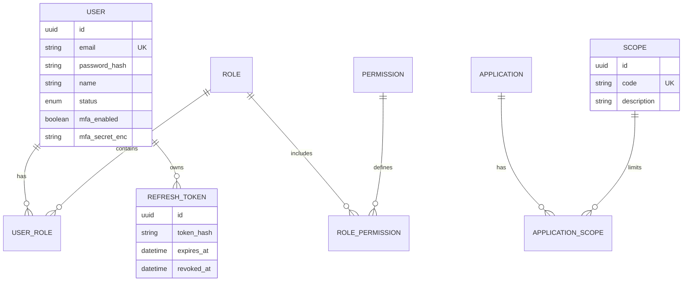

# Core Engine & Auth — Identity, Access & Integration Core (Squad 1)

**Versão:** 2.0 (implementation-ready)  
**Squad:** Squad 1  
**Papel:** Produto central de identidade, autenticação, autorização, permissionamento e integração segura do ERP Modular Cloud-Native.

---

## 1. Visão geral

O **Core Engine & Auth** é o sistema central de **IAM (Identity and Access Management)** do ecossistema. Opera em **duas frentes complementares**:

1. **Identity Core (uso interno ao ERP)** — Fornece autenticação, autorização (RBAC), gestão de usuários, papéis e permissões, e proteção de rotas para todos os módulos e squads internos, de forma transparente e padronizada.
2. **Integration Core (produto para aplicações/clientes)** — Permite que sistemas de terceiros e parceiros integrem de forma segura via **credenciais de aplicação** (`client_id` / `client_secret`), **escopos** e **tokens de integração**, sem expor o modelo de usuário humano da mesma forma que o fluxo interativo.

O **backend (API REST)** é a entrega principal; um **frontend administrativo** (opcional no MVP) é secundário e pode consumir os mesmos endpoints com perfis administrativos.

---

## 2. Problema

Squads e integradores precisam de **um único lugar** para:

- autenticar usuários humanos com políticas de senha e tokens coerentes;
- aplicar **RBAC** com papéis e permissões auditáveis;
- emitir e renovar **JWT** de forma segura (access + refresh com rotação);
- autenticar **aplicações** (machine-to-machine) com escopos explícitos;
- evitar que cada módulo reinvente login, permissões e integração — com risco de inconsistência e falhas de segurança.

Sem esse núcleo, o ecossistema fragmenta regras de acesso, dificulta auditoria e aumenta o custo de manutenção.

---

## 3. Proposta de valor

| Dimensão | Benefício |
|----------|-----------|
| **Segurança** | Hash de senha moderno (Argon2id preferencial), MFA (TOTP), rotação de refresh token, rate limiting, headers seguros (Helmet). |
| **Desacoplamento** | Squads focam em domínio; IAM, RBAC e integração ficam no Core. |
| **Interoperabilidade** | JWT, REST, OpenAPI; consumo por qualquer stack. |
| **Auditabilidade** | Logs e auditoria mínimos de autenticação e mudanças críticas de acesso. |
| **Produto vendável** | Pode ser oferecido como serviço de identidade e integração **sem** multi-tenant, **sem** OIDC completo no MVP — ainda assim útil e com roadmap claro. |

---

## 4. Personas

| Persona | Necessidade principal |
|---------|------------------------|
| **Desenvolvedor de módulo (ERP interno)** | Validar JWT, obter usuário atual, checar permissões sem reimplementar IAM. |
| **Administrador de sistema** | CRUD de usuários, papéis, permissões; ativar/desativar contas e aplicações. |
| **Integrador / Dev externo** | Registrar aplicação, receber credenciais, configurar escopos, obter token de integração e documentação estável. |
| **Auditor / Segurança** | Rastrear logins falhos, alterações sensíveis e eventos críticos (dentro do que o MVP cobrir). |

---

## 5. Escopo do produto (MVP)

### 5.1. Núcleo interno (usuários humanos)

- Cadastro de usuário (registro) e login e-mail + senha.
- Hash seguro de senha e validação de política.
- Emissão de **access token** (JWT) e **refresh token** com rotação.
- Endpoint `GET /v1/auth/me` (perfil + papéis/permissões efetivas conforme modelo).
- Gestão de usuários, papéis e permissões (CRUD administrativo conforme endpoints).
- Associação usuário ↔ papel e papel ↔ permissão.
- **RBAC** para autorização de operações.
- **MFA** via **TOTP (RFC 6238)** — ativação, verificação no login; obrigatoriedade configurável para perfis administrativos quando política interna exigir.
- Proteção de rotas (Guards NestJS + validação JWT).
- Logs e auditoria **básica** (ver seção 23).
- Documentação **Swagger/OpenAPI 3** gerada e utilizável (“Try it out”).

### 5.2. Camada de integração (aplicações)

- Cadastro de aplicações/clientes e emissão de credenciais (`client_id` + `client_secret`).
- Escopos por aplicação (catálogo + vínculo aplicação–escopo).
- Emissão e gestão de **token de integração** (JWT de tipo integração, claims adequados).
- Documentação pública de integração (contratos e exemplos — pode viver no repositório e/ou Swagger).

### 5.3. Infraestrutura de entrega

- Stack: **TypeScript**, **NestJS**, **PostgreSQL**, **Prisma**, **JWT**, **Swagger**, **Docker**, **Jest**, **class-validator**, **class-transformer**.
- API versionada em **`/v1`**, JSON, Bearer Token onde aplicável.

---

## 6. Escopo fora do produto (MVP)

| Item | Status |
|------|--------|
| **Multi-tenant** | **Fora de escopo** — modelo single-tenant explícito. |
| **Login social / Google / provedores OIDC externos** | **Fora do MVP**. |
| **Plataforma IAM completa estilo Keycloak** | **Fora do escopo** — produto propositalmente enxuto. |
| **OAuth 2.0 / OpenID Connect como servidor de autorização completo** | **Roadmap** (ver seção 27), não requisito do MVP. |
| **Frontend como prioridade** | **Secundário**; não bloqueia entrega do backend. |
| **SSO corporativo (SAML, etc.)** | Fora do MVP. |

**Nota:** O produto permanece **vendável e útil** sem multi-tenant e sem OIDC: foco em JWT + RBAC + integração por credenciais e escopos.

---

## 7. Requisitos funcionais (numerados)

| ID | Requisito |
|----|-----------|
| **RF01** | Cadastro de usuário com e-mail único, nome e senha conforme política (ver RNFs e regras de negócio). |
| **RF02** | Autenticação de usuário com e-mail e senha; usuário inativo não autentica. |
| **RF03** | Emissão de access token JWT após login bem-sucedido (ou após MFA quando aplicável). |
| **RF04** | Emissão e renovação de refresh token com **rotação**: uso único do refresh enviado; novo par access/refresh após troca válida. |
| **RF05** | Ativação de MFA (TOTP): geração de segredo, exibição de URI/QR para app autenticador; confirmação com código. |
| **RF06** | Desativação de MFA mediante reautenticação e/ou código TOTP (fluxo mínimo definido na implementação, consistente com segurança). |
| **RF07** | Verificação MFA no login: se MFA ativo, após credenciais válidas exigir passo TOTP antes de emitir tokens finais. |
| **RF08** | Endpoint `GET /v1/auth/me` retornando dados do usuário autenticado e autorizações efetivas (papéis/permissões). |
| **RF09** | CRUD de usuários (listagem paginada, detalhe, criação, atualização, alteração de status). |
| **RF10** | CRUD de papéis (roles). |
| **RF11** | CRUD de permissões (permissions); código único semântico (ex.: `user:write:all`). |
| **RF12** | Vínculo usuário–papel (associação e remoção em escopo de role). |
| **RF13** | Vínculo papel–permissão. |
| **RF14** | Cadastro de aplicação com nome, identificadores e status. |
| **RF15** | Geração e **regeneração** de `client_secret`; segredo **exibível apenas** na criação ou regeneração (nunca em listagens/detalhes posteriores). |
| **RF16** | Definição de escopos permitidos por aplicação (associação e listagem). |
| **RF17** | Emissão de token de integração mediante `client_id` + `client_secret` (fluxo M2M); aplicação inativa não recebe token. |
| **RF18** | Validação de escopos no consumo dos recursos protegidos por token de integração (conforme estratégia acordada no backend). |
| **RF19** | Endpoint de saúde `GET /v1/health` para probes (liveness/readiness conforme impl.). |
| **RF20** | Documentação OpenAPI atualizada com todos os endpoints públicos do MVP. |

---

## 8. Requisitos não funcionais (mensuráveis)

| ID | Categoria | Requisito |
|----|-----------|-----------|
| **RNF01** | Performance | Latência p95 **menor que 300 ms** em endpoints de leitura simples (`/health`, `/auth/me`) em ambiente de referência (hardware definido no projeto), sem carga extrema. |
| **RNF02** | Performance | `POST /v1/auth/login` e `POST /v1/integration/token` p95 **menor que 500 ms** em condições normais de laboratório. |
| **RNF03** | Tokens | Access token: TTL padrão **15 minutos** (configurável via env); refresh token: TTL padrão **7 dias** (configurável). |
| **RNF04** | Tokens | Algoritmo JWT: **HS256** no MVP (secret forte em env); documentar migração futura para RS256 se necessário. |
| **RNF05** | Testes | Cobertura de testes unitários **≥ 80%** em módulos de domínio crítico (auth, autorização, integração). |
| **RNF06** | Testes | Testes e2e mínimos para fluxos: login, refresh, `/me`, token integração. |
| **RNF07** | Rate limit | **5 tentativas/minuto** por IP **e** por e-mail em `login` e rotas análogas sensíveis; bloqueio temporário **30 min** após **5 falhas consecutivas** (valores alinhados ao PRD original). |
| **RNF08** | Senha | Argon2id (preferencial) ou Bcrypt cost ≥ 12; comprimento mínimo **10** caracteres; complexidade: maiúscula, minúscula, número e especial; lista de senhas comuns rejeitada. |
| **RNF09** | Disponibilidade | Healthcheck utilizável por orquestrador; falha de dependência refletida de forma clara. |
| **RNF10** | Manutenibilidade | Código TypeScript estrito; validação de entrada com class-validator; sem segredos no repositório. |
| **RNF11** | Logs | Logs estruturados (JSON) com `requestId` correlacionável quando possível. |

*(Ajuste métricas de performance ao ambiente acadêmico/produção no plano de testes.)*

---

## 9. Regras de negócio

| ID | Regra |
|----|--------|
| **RN01** | Usuário com status **inativo** (ou equivalente) **não** autentica. |
| **RN02** | `client_secret` só é retornado **na criação** da aplicação ou após **`regenerate-secret`**; demais respostas mascaram ou omitem. |
| **RN03** | Refresh token: **rotação obrigatória** — após uso, token antigo invalidado; tentativa de reuso deve falhar com erro de segurança claro. |
| **RN04** | Aplicação **inativa** não obtém token de integração. |
| **RN05** | **Escopos** limitam o que a aplicação pode fazer em nome do fluxo M2M; **permissões RBAC** limitam o que **usuários humanos** fazem nos endpoints administrativos. |
| **RN06** | MFA é **etapa adicional** após credenciais válidas: não emitir access/refresh “finais” até MFA concluído quando MFA estiver habilitado. |
| **RN07** | E-mail de usuário e códigos únicos (`permission.code`, `role.name`, `application.clientId` onde aplicável) devem gerar **409 Conflict** em duplicidade. |
| **RN08** | Permissões devem existir antes de vincular a papéis; usuários devem existir antes de vincular a papéis (validação referencial). |
| **RN09** | Papéis sugeridos para documentação: `admin`, `manager`, `operator`, `viewer` — podem ser criados via API conforme RF10. |

---

## 10. Casos de uso principais

1. **Registrar e logar** — Usuário cria conta, faz login; se MFA ativo, completa TOTP e recebe tokens.
2. **Renovar sessão** — Cliente envia refresh válido e recebe novo par com rotação.
3. **Obter contexto** — Cliente chama `/auth/me` com Bearer access token.
4. **Administrar acesso** — Admin gerencia usuários, papéis, permissões e vínculos.
5. **Integrar sistema externo** — Cadastra aplicação, guarda secret, associa escopos, obtém token via `/integration/token` e chama APIs permitidas.

---

## 11. Fluxos principais

### 11.1. Autenticação humana (sem MFA)

```
Cliente → POST /v1/auth/login (email, password)
Servidor valida credenciais e status → emite access + refresh
Cliente → requisições com `Authorization: Bearer {access_token}`
```

### 11.2. Autenticação com MFA (TOTP)

```
Cliente → POST /v1/auth/login
Servidor → 200 com payload indicando mfa_required e mfa_challenge (token opaco de curta duração) OU 403/401 específico conforme contrato fixado na API
Cliente → POST /v1/auth/mfa/verify (challenge + código TOTP)
Servidor valida → emite access + refresh
```

*(O contrato exato do passo intermediário deve ser único na API; recomenda-se um `mfaPendingToken` JWT de curta duração ou string opaca armazenada com TTL.)*

### 11.3. Refresh token (rotação)

```
Cliente → POST /v1/auth/refresh (refresh_token)
Servidor valida, invalida refresh usado, emite novo access + novo refresh
```

### 11.4. RBAC (autorização)

```
Request → Guard JWT → extrai sub / roles / perms
Guard de permissão → verifica permissão necessária na rota
Negado → 403 + error.code adequado
```

### 11.5. Integração M2M

```
Cliente → POST /v1/integration/token (client_id, client_secret [, scope opcional])
Servidor valida aplicação ativa, escopos solicitados ⊆ escopos cadastrados
Emite JWT tipo integração com claims de escopos e identificação da aplicação
```

### 11.6. Ativação MFA

```
Usuário autenticado → POST /v1/auth/mfa/enable
Servidor gera segredo TOTP, retorna otpauth URI / dados para QR
Usuário → POST /v1/auth/mfa/verify (primeira verificação) para confirmar e ligar mfaEnabled
```

---

## 12. Especificação técnica

### 12.1. Módulos sugeridos (NestJS)

| Módulo | Responsabilidade |
|--------|------------------|
| **Auth** | Register, login, refresh, MFA, `/me` |
| **Users** | CRUD usuários, status |
| **Roles** | CRUD roles, vínculos usuários e permissões |
| **Permissions** | CRUD permissões |
| **Applications** | CRUD apps, escopos, regenerate secret |
| **Integration** | Emissão de token M2M |
| **Health** | Healthcheck |
| **Common** | Filtros de exceção, envelope resposta, interceptors, requestId |

### 12.2. Componentes

- **Controllers** — Rotas REST versionadas.
- **Guards** — `JwtAuthGuard`, `PermissionsGuard`, guard para tipo de token (usuário vs integração) quando necessário.
- **Strategies** — Passport JWT para validação de assinatura e claims.
- **Services** — Regras de negócio e orquestração.
- **Prisma** — Persistência; transações para rotação de refresh e vínculos críticos.

### 12.3. Relações entre componentes

```
HTTP → Middleware (Helmet, rate limit) → ValidationPipe → Guard → Controller → Service → Prisma → PostgreSQL
```

### 12.4. Estratégia de escopos (integração)

- Catálogo global de **Scope** (`code` único, ex.: `orders.read`).
- **ApplicationScope** vincula aplicação a um subconjunto de escopos.
- Token de integração carrega `scopes: string[]` concedidos (interseção do pedido com o cadastrado).

### 12.5. Eventos assíncronos (evolução)

O PRD original citou eventos (`user.created`, etc.) via message broker — tratar como **roadmap pós-MVP** ou fase 2, salvo decisão explícita do time de incluir fila no MVP.

---

## 13. Arquitetura sugerida

- **API monolítica modular** NestJS (adequado ao MVP).
- **PostgreSQL** como fonte de verdade relacional.
- **Docker Compose** para app + banco em desenvolvimento; variáveis por ambiente.
- **Sem multi-tenant**: um único contexto organizacional por deployment (configurável por env).

---

## 14. Catálogo de endpoints (`/v1`)

Métodos e corpos devem ser detalhados no Swagger; abaixo o contrato alvo.

### 14.1. Saúde

| Método | Rota | Descrição |
|--------|------|-----------|
| `GET` | `/v1/health` | Status do serviço e dependências críticas. |

### 14.2. Autenticação (fluxo humano)

| Método | Rota | Descrição |
|--------|------|-----------|
| `POST` | `/v1/auth/register` | Cadastro de usuário. |
| `POST` | `/v1/auth/login` | Login e-mail/senha; pode retornar etapa MFA. |
| `POST` | `/v1/auth/refresh` | Renovação com rotação de refresh token. |
| `POST` | `/v1/auth/mfa/enable` | Inicia MFA (TOTP) — requer autenticação. |
| `POST` | `/v1/auth/mfa/verify` | Verifica código TOTP (login pendente ou confirmação de enable). |
| `GET` | `/v1/auth/me` | Perfil e autorizações do usuário autenticado. |

### 14.3. Usuários

| Método | Rota | Descrição |
|--------|------|-----------|
| `GET` | `/v1/users` | Lista paginada (filtros: email, status). |
| `GET` | `/v1/users/:id` | Detalhe. |
| `POST` | `/v1/users` | Criação (admin). |
| `PATCH` | `/v1/users/:id` | Atualização parcial. |
| `PATCH` | `/v1/users/:id/status` | Ativar/inativar. |

### 14.4. Papéis e permissões

| Método | Rota | Descrição |
|--------|------|-----------|
| `GET` | `/v1/roles` | Lista papéis. |
| `POST` | `/v1/roles` | Cria papel. |
| `GET` | `/v1/permissions` | Lista permissões. |
| `POST` | `/v1/permissions` | Cria permissão. |
| `POST` | `/v1/roles/:id/users` | Associa usuário(s) ao papel (body com userId ou lista). |
| `POST` | `/v1/roles/:id/permissions` | Associa permissão(ões) ao papel. |

*Operações de remoção podem ser `DELETE` nos mesmos recursos ou sub-rotas — definir no OpenAPI de forma única (ex.: `DELETE /v1/roles/:roleId/users/:userId`).*

### 14.5. Aplicações e integração

| Método | Rota | Descrição |
|--------|------|-----------|
| `GET` | `/v1/applications` | Lista aplicações. |
| `GET` | `/v1/applications/:id` | Detalhe (sem secret). |
| `POST` | `/v1/applications` | Cria aplicação; retorna `client_secret` **uma vez**. |
| `PATCH` | `/v1/applications/:id` | Atualização. |
| `PATCH` | `/v1/applications/:id/status` | Ativar/desativar. |
| `POST` | `/v1/applications/:id/regenerate-secret` | Novo secret; exibido **uma vez**. |
| `POST` | `/v1/applications/:id/scopes` | Associa escopos à aplicação. |
| `GET` | `/v1/applications/:id/scopes` | Lista escopos da aplicação. |
| `POST` | `/v1/integration/token` | OAuth-style client credentials **simplificado** — retorna access token M2M. |

### 14.6. Documentação

| Método | Rota | Descrição |
|--------|------|-----------|
| `GET` | `/v1/docs` ou `/api` | Swagger UI (convenção Nest; expor de forma segura por ambiente). |

---

## 15. Modelo de dados

### 15.1. Diagrama ER (conceitual)



### 15.2. Entidades e enums (resumo)

| Entidade | Descrição |
|----------|-----------|
| **User** | Dados de conta; `passwordHash`; `status` (enum: `ACTIVE`, `INACTIVE`, …); `mfaEnabled`; segredo MFA armazenado de forma segura (criptografado em repouso recomendado). |
| **Role** | Papel agregador de permissões; `name` único. |
| **Permission** | `code` único semântico; descrição. |
| **UserRole** | N:N usuário e papel. |
| **RolePermission** | N:N papel e permissão. |
| **RefreshToken** | Token opaco ou hash do token; `userId`; `expiresAt`; `revokedAt`; `replacedBy` opcional para auditoria de rotação. |
| **Application** | `clientId` público único; `clientSecretHash`; `name`; `status` (`ACTIVE` / `INACTIVE`). |
| **Scope** | Catálogo global de escopos integráveis. |
| **ApplicationScope** | N:N aplicação e escopo. |
| **AuthAuditLog** (opcional recomendado) | Eventos: `LOGIN_SUCCESS`, `LOGIN_FAILURE`, `TOKEN_REFRESH`, `MFA_FAIL`, `CLIENT_CREDENTIALS_SUCCESS` — com `userId`/`applicationId`, IP, user-agent, timestamp. |

### 15.3. Schema Prisma (referência estendida)

```prisma
enum UserStatus {
  ACTIVE
  INACTIVE
}

enum AppStatus {
  ACTIVE
  INACTIVE
}

model User {
  id            String         @id @default(uuid())
  email         String         @unique
  passwordHash  String
  name          String
  status        UserStatus     @default(ACTIVE)
  mfaEnabled    Boolean        @default(false)
  mfaSecret     String?        // criptografado em repouso (recomendado)
  roles         UserRole[]
  refreshTokens RefreshToken[]
  createdAt     DateTime       @default(now())
  updatedAt     DateTime       @updatedAt
}

model RefreshToken {
  id          String    @id @default(uuid())
  tokenHash   String    @unique
  userId      String
  user        User      @relation(fields: [userId], references: [id], onDelete: Cascade)
  expiresAt   DateTime
  revokedAt   DateTime?
  replacedById String?
  createdAt   DateTime  @default(now())
}

model Role {
  id          String           @id @default(uuid())
  name        String           @unique
  permissions RolePermission[]
  users       UserRole[]
}

model Permission {
  id          String           @id @default(uuid())
  code        String           @unique
  description String
  roles       RolePermission[]
}

model UserRole {
  userId String
  roleId String
  user   User   @relation(fields: [userId], references: [id], onDelete: Cascade)
  role   Role   @relation(fields: [roleId], references: [id], onDelete: Cascade)

  @@id([userId, roleId])
}

model RolePermission {
  roleId       String
  permissionId String
  role         Role       @relation(fields: [roleId], references: [id], onDelete: Cascade)
  permission   Permission @relation(fields: [permissionId], references: [id], onDelete: Cascade)

  @@id([roleId, permissionId])
}

model Application {
  id               String              @id @default(uuid())
  clientId         String              @unique
  clientSecretHash String
  name             String
  status           AppStatus           @default(ACTIVE)
  scopes           ApplicationScope[]
  createdAt        DateTime            @default(now())
  updatedAt        DateTime            @updatedAt
}

model Scope {
  id          String               @id @default(uuid())
  code        String               @unique
  description String
  applications ApplicationScope[]
}

model ApplicationScope {
  applicationId String
  scopeId       String
  application   Application @relation(fields: [applicationId], references: [id], onDelete: Cascade)
  scope         Scope       @relation(fields: [scopeId], references: [id], onDelete: Cascade)

  @@id([applicationId, scopeId])
}
```

---

## 16. Estratégia de autenticação e autorização

### 16.1. JWT — usuário humano (access)

**Claims sugeridos:**

```json
{
  "sub": "uuid-do-usuario",
  "email": "user@company.com",
  "type": "user_access",
  "roles": ["admin"],
  "perms": ["user:write:all", "user:read:all"],
  "iat": 1711049615,
  "exp": 1711053215
}
```

### 16.2. JWT — integração (M2M)

```json
{
  "sub": "uuid-da-aplicacao",
  "type": "integration_access",
  "clientId": "app_abc123",
  "scopes": ["orders.read", "orders.write"],
  "iat": 1711049615,
  "exp": 1711053215
}
```

### 16.3. Autorização

- **Usuários:** checagem de **permissions** nas rotas administrativas e de gestão.
- **Integração:** checagem de **scopes** nas rotas expostas ao M2M (pode ser subset de endpoints ou mesmos endpoints com policy diferente conforme design).

---

## 17. Estratégia de integração de aplicações

1. Admin cria **Application** → recebe `client_id` e `client_secret` (uma vez).
2. Admin associa **Scopes** permitidos.
3. Sistema cliente obtém token via `POST /v1/integration/token`.
4. APIs validam JWT de integração e escopos necessários.

**OAuth 2.0 / OIDC** completos ficam no **roadmap** (autorização de terceiros, discovery, etc.).

---

## 18. Padrão de output da API (sucesso)

Alinhar todos os endpoints ao envelope:

```json
{
  "success": true,
  "message": "Mensagem amigável opcional",
  "data": {},
  "timestamp": "2026-03-20T23:00:00Z",
  "path": "/v1/exemplo"
}
```

**Campos adicionais permitidos** para correlação:

```json
"meta": {
  "requestId": "req_abc123"
}
```

Recomenda-se **sempre** incluir `timestamp` (ISO 8601 UTC) e `path` da requisição; `message` pode ser omitida em leituras simples se o time padronizar apenas em writes.

---

## 19. Padrão de erros e `error.code`

```json
{
  "success": false,
  "error": {
    "code": "AUTH_INVALID_CREDENTIALS",
    "message": "E-mail ou senha incorretos",
    "details": {}
  },
  "timestamp": "2026-03-21T18:30:00Z",
  "path": "/v1/auth/login"
}
```

### 19.1. Catálogo inicial de códigos (extensível)

| Código HTTP | `error.code` | Uso |
|-------------|--------------|-----|
| 400 | `VALIDATION_ERROR` | Payload inválido |
| 401 | `AUTH_INVALID_CREDENTIALS` | Login falho |
| 401 | `AUTH_TOKEN_EXPIRED` | Access expirado |
| 401 | `AUTH_TOKEN_INVALID` | Assinatura/ formato inválido |
| 401 | `AUTH_MFA_REQUIRED` | MFA pendente |
| 403 | `AUTHZ_FORBIDDEN` | Sem permissão/escopo |
| 404 | `RESOURCE_NOT_FOUND` | Recurso inexistente |
| 409 | `RESOURCE_CONFLICT` | Duplicidade |
| 429 | `RATE_LIMIT_EXCEEDED` | Muitas tentativas |
| 500 | `INTERNAL_ERROR` | Erro interno |

---

## 20. Segurança (consolidado)

- **Senhas:** ver RNF08; Argon2id preferencial.
- **MFA:** TOTP RFC 6238; apps compatíveis (Google Authenticator, Authy, etc.).
- **Tokens:** rotação de refresh; secrets fortes; tempo de vida configurável.
- **Transporte:** HTTPS em produção.
- **Headers:** Helmet (HSTS, CSP adequado ao front, X-Frame-Options, etc.).
- **Rate limiting e lockout:** ver RNF07.
- **Armazenamento:** segredos apenas em env/secret manager; nunca em código.

---

## 21. Observabilidade e auditoria

| Evento | Nível mínimo |
|--------|----------------|
| Login sucesso/falha | Log + opcional tabela `AuthAuditLog` |
| Refresh e falha de rotação | Log |
| MFA falha | Log |
| Regenerate secret | Log + auditoria |
| Mudança de status usuário/app | Log / auditoria |

Formato: **JSON estruturado** com `requestId`, timestamp, rota, `userId` ou `clientId` quando aplicável.

---

## 22. Critérios de aceitação de alto nível

| # | Critério |
|---|----------|
| CA01 | Dado usuário ativo, quando credenciais corretas em `/auth/login`, então recebe access e refresh válidos e consegue chamar `/auth/me`. |
| CA02 | Dado usuário inativo, quando tenta login, então recebe erro 401 com código adequado e **não** recebe tokens. |
| CA03 | Dado refresh válido, quando chama `/auth/refresh`, então recebe novo par e refresh antigo deixa de funcionar. |
| CA04 | Dado refresh já usado, quando reutilizado, então erro 401 e evento logado. |
| CA05 | Dado MFA habilitado, quando login sem TOTP, então não emite tokens finais até verificação bem-sucedida. |
| CA06 | Dado admin, quando cria aplicação, então vê `client_secret` apenas nessa resposta. |
| CA07 | Dado aplicação inativa, quando pede token de integração, então 401/403 com código claro. |
| CA08 | Dado token de integração, quando escopo não inclui operação, então 403. |
| CA09 | Dado e-mail duplicado no registro, então 409 `RESOURCE_CONFLICT`. |
| CA10 | Swagger descreve todos os endpoints do catálogo MVP e exemplos de erro. |

---

## 23. Definition of Done (DoD)

- [ ] Cobertura de testes unitários ≥ 80% nos módulos críticos (RNF05).
- [ ] Testes e2e dos fluxos principais (RNF06).
- [ ] Swagger/OpenAPI completo e testável (“Try it out”) para `/v1`.
- [ ] Sem segredos em plain-text no repositório; revisão de configuração.
- [ ] CI com lint, testes e build.
- [ ] Logs estruturados JSON com requestId (RNF11).
- [ ] Healthcheck utilizável (`GET /v1/health`).
- [ ] Documentação de integração pública disponível (README ou site docs do repositório).

---

## 24. Riscos e limites do MVP

| Risco / limite | Mitigação |
|----------------|-----------|
| HS256 com secret vazado compromete todos os tokens | Rotacionar secret; planejar RS256; secrets fortes e rotação operacional. |
| Escopo de integração mal configurado | Revisão de API; testes de autorização por escopo. |
| MFA perda de dispositivo | Roadmap: códigos de recuperação ou fluxo admin (fora do MVP mínimo). |
| Sem multi-tenant | Documentar claramente para clientes que precisam isolamento por tenant em outro produto ou deployment. |

---

## 25. Roadmap futuro

- **OAuth 2.0 / OpenID Connect** como servidor de autorização (Authorization Server) — fluxos adicionais, discovery, JWKS.
- **Eventos de domínio** (Kafka/RabbitMQ) para `user.created`, `role.permissions_updated`, etc.
- **Códigos de backup MFA** e políticas avançadas de recuperação.
- **RS256** e rotação de chaves públicas.
- **Frontend admin** completo (UX, dashboards de auditoria).
- **Rate limit** distribuído (Redis) em ambientes clusterizados.

---

## 26. Referências e consistência

Este documento preserva e amplia a visão do **Core Engine & Auth** como **Identity, Access & Integration Core**, mantém a stack **TypeScript, NestJS, PostgreSQL, Prisma, JWT, Swagger, Docker, Jest**, REST pragmático com **`/v1`**, padrão de envelope e `error.code`, modelo **User, Role, Permission, Application** com **RefreshToken**, **Scope** e **ApplicationScope**, foco em **segurança**, **backend como entrega principal**, **sem multi-tenant**, e **OAuth/OIDC apenas como evolução**.

---

*Documento destinado a projeto acadêmico, apresentação técnica, orientação de desenvolvimento e organização de backlog do Squad 1.*
